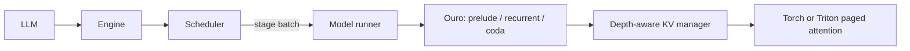

# vllm-lt

A standalone inference engine for **ByteDance/Ouro-1.4B**, organized like vLLM,
with continuous batching at **individual recurrent-loop boundaries** and a
depth-aware paged KV cache. Based on
[Continuous Depth Batching (CDB)](https://arxiv.org/abs/2608.09444).

This first implementation supports native checkpoint loading, full-depth
chunked prefill, adaptive decode, refill/no-refill scheduling, greedy and
seeded top-k/top-p sampling, streaming engine steps, cancellation, and a Triton
paged-attention backend. CPU execution provides a reference backend.

It is a synchronous, single-device implementation. The paper's asynchronous
lookahead scheduling, CUDA graphs, distributed execution, prefix sharing,
preemption, and an HTTP server are not implemented. No throughput or task-accuracy
claims are made. The authors' CDB code and trained lookahead gate were not
released at the revision inspected; see [paper notes](docs/paper-notes.md).

BF16 is the primary GPU inference and performance target, with FP32
accumulation/reductions in numerically sensitive operations. Full-model FP32
is a diagnostic/reference configuration. The [precision policy](docs/precision-policy.md)
separates BF16 storage/compute from accumulation precision and defines the
requirements for new validation and benchmark work.

The historical [Q1 run](docs/validation/q1-20260911.md) passed its FP32 comparisons and
failed its original BF16 contract; the reference discrepancy remains unresolved.
Those results are retained while BF16 evaluation proceeds under an explicit
mixed-precision contract. They do not establish BF16 quality or performance.

The [roadmap](docs/roadmap.md) prioritizes faster Ouro inference.
BF16 performance and numerical validation proceed together, with profiling
guiding runtime, CUDA-graph, attention, and KV improvements.

## Install and run

Python 3.10+ and PyTorch 2.5+ are required. Use an appropriate existing environment
or create a virtual environment, then install:

```bash
python -m pip install -e '.[text,triton,dev]'
```

For a CPU smoke test with a **tiny, randomly initialized** Ouro architecture:

```bash
OMP_NUM_THREADS=1 python -m vllm_lt.entrypoints.cli --toy --max-tokens 4 --exit-threshold 0.7
```

For the pretrained model on a GPU, run inside your scheduler's reservation.
Choose an available exact device ID from its status output:

```bash
gpu status
gpu run --gpu-ids <available-id> --timeout 20m --note "vllm-lt Ouro inference" -- \
  python -m vllm_lt.entrypoints.cli \
  --model ByteDance/Ouro-1.4B --device cuda --dtype bfloat16 \
  --attention-backend triton --prompt 'The capital of France is' \
  --prompt '2 + 2 =' --max-tokens 32 --exit-threshold 0.7
```

Omit the scheduler wrapper on a dedicated machine without a GPU reservation
system. The engine leaves device visibility to the caller. The official model
and tokenizer default to immutable revision
`574fa66cb8bf5abdc979642d01cf2b79b16bfab1`; `--model` also accepts a local checkpoint
directory. Loading uses native code and safetensors, without `trust_remote_code`.

Specify BF16 explicitly: the current API/CLI fallback default remains FP32.
The BF16 workflow requirement does not silently change that runtime default.

## Python API

```python
from vllm_lt import LLM, CacheConfig, SamplingParams, SchedulerConfig
from vllm_lt.models import OuroConfig, OuroForCausalLM

# Small CPU example. This model has random weights, not pretrained language ability.
model = OuroForCausalLM(OuroConfig.tiny())
llm = LLM(
    model,
    cache_config=CacheConfig(num_blocks=64, block_size=4),
    scheduler_config=SchedulerConfig(mode="refill", max_num_seqs=4),
)
outputs = llm.generate(
    [[1, 2, 3], [4, 5]],
    SamplingParams(max_tokens=8, min_loops=2, max_loops=4, exit_threshold=0.7, ignore_eos=True),
)
for output in outputs:
    print(output.token_ids, output.exit_depths, output.finish_reason)
```

Use `LLM("ByteDance/Ouro-1.4B", device="cuda", dtype=torch.bfloat16,
attention_backend="triton")` inside a reservation for pretrained text prompts.
The facade accepts a list of text prompts or a list of token-ID lists, and one
`SamplingParams` object or one per prompt. Outputs preserve input order.

For dynamic arrivals, call `llm.engine.add_request(id, token_ids, params)`, then
`llm.engine.step()` repeatedly. Each step executes one scheduled stage and returns
cumulative `RequestOutput` objects when the coda samples tokens. Add new requests
between steps, and call `abort_request(id)` to cancel. `has_unfinished_requests()`
indicates whether work remains. The engine API is synchronous and is not thread-safe.

## Architecture and semantics



The scheduler owns request state, loop counts, and four work queues. The model
runner executes each stage; model weights are shared across recurrence depths.
Refill mode lets a token start its first loop alongside another request's deeper
loop. No-refill mode drains a recurrent cohort before running its coda and
starting another cohort. Queue and token budgets apply at stage boundaries.

Ouro's exit gate emits a conditional probability at each loop. The engine exits
when `1 - product(1 - sigmoid(gate_i)) >= exit_threshold`, subject to the loop
bounds. `exit_threshold=1.0` explicitly disables early exit; the default decode
minimum is two loops. A token's RoPE position stays fixed through all its loops.

Prompt chunks always run all model loops. The final prompt hidden state goes
directly to coda to predict the first output token. Therefore the first entry in
`exit_depths` is the full prefill depth; subsequent entries describe adaptive
decode. This prefill policy is an explicit implementation choice, not a claim to
reproduce every detail of the paper's experiments.

KV pages are allocated separately for each request and loop depth. On early
exit, every layer's final KV is copied into skipped deeper depths, implementing
the paper's **last-exited** semantics. A later token can attend at greater depth
without encountering unwritten entries. Single-slot shared KV is deliberately
unsupported because it changes Ouro's attention behavior.

`num_blocks` counts physical pages **across all depths**; each page stores all
physical transformer layers. Admission reserves
`ceil((prompt_tokens + max_tokens - 1) / block_size) * model_loops` pages per
request. Requests too large for the pool are rejected; temporary pressure queues
requests until pages are released. This guarantees room to finish admitted work,
at the cost of lower utilization than incremental allocation with preemption.
KV bytes are `2 * num_blocks * layers * block_size * kv_heads * head_dim * dtype_bytes`.
With the defaults, Ouro uses 768 MiB of KV storage in BF16 (256 pages, 16 tokens).

The Triton kernel uses an independent page table and causal length for each row,
GQA head mapping, and FP32 online softmax. It supports head dimensions up to 256;
selecting it on CPU raises an error. Model configuration validation rejects
unsupported sliding attention, RoPE scaling, tied embeddings, and other unknown
architectural fields. See [design](docs/design.md) for ownership and invariants.

## Validation

```bash
OMP_NUM_THREADS=1 python -m pytest -q
python -m ruff check .
python -m ruff format --check .

# CUDA tests are opt-in and must run inside a reservation on a shared host.
gpu run --gpu-ids <available-id> --timeout 10m --note "vllm-lt kernel tests" -- \
  python -m pytest -q tests/test_attention.py --run-gpu
```

Tests cover dense-vs-paged model execution, GQA, packed causal prefill, varying
depths, cache holes, early-exit propagation, fragmented pages, bounded admission,
EOS/cancellation, refill/no-refill equivalence, checkpoint validation, and sampling
independence. [Validation notes](docs/validation/initial-20260910.md) record the actual environment
and checks performed. These correctness checks do not establish serving performance
or adaptive-depth language-task accuracy.

The [results index](docs/benchmarks.md) links completed experiments and their
archived reproduction harness. The current checkout retains reusable profiling,
replay, independent reference and tensor-comparison helpers; historical M1/Q1/M2
controllers, fixed contracts and their dedicated tests have been removed.
New comparisons follow the [precision policy](docs/precision-policy.md).

## License

Apache-2.0; see [LICENSE](LICENSE) and [NOTICE](NOTICE). The native model adapts
the published Ouro architecture and preserves upstream attribution.
