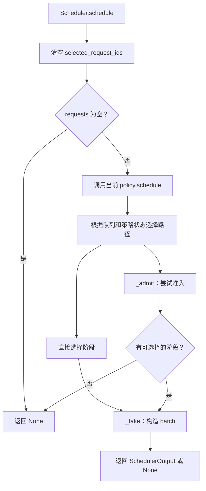
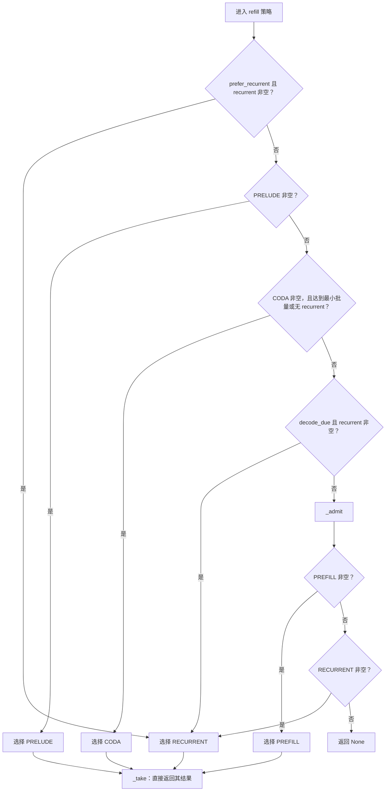
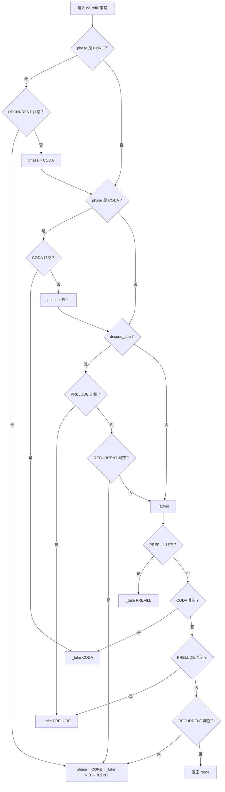
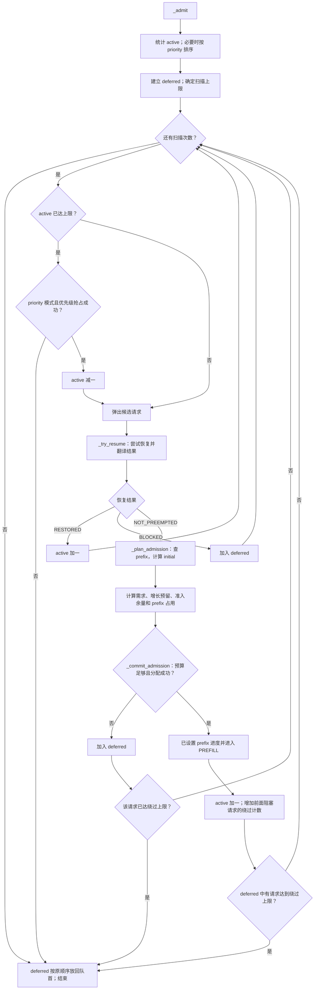
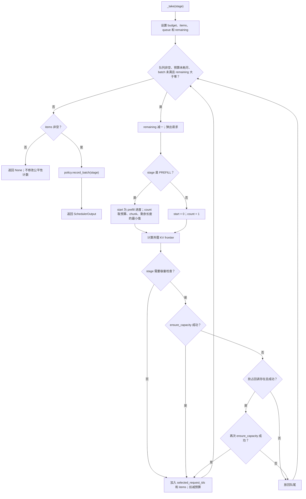

# Scheduler 职责与调度流程

本文对应本轮 M3 重构后的代码：

- [scheduler.py](../vllm_lt/core/scheduler.py)：请求登记、终止、准入和 batch 构造。
- [scheduling_policy.py](../vllm_lt/core/scheduling_policy.py)：refill/no-refill 阶段选择及公平性状态。
- [request.py](../vllm_lt/request.py)：请求阶段、终止原因和输出转换。
- [preemption.py](../vllm_lt/engine/preemption.py)：抢占与恢复回调的实现。

## 先看这一条主线

调度器要解决的是：多个请求共享 GPU 时，哪些请求能进入、这轮做什么、具体凑哪些请求一起执行。

```text
schedule：判断是否有请求，再按阶段策略安排已有工作和准入时机
    ↓ 必要时
_admit：等待排序 → 争取名额 → 恢复或分配 → 入队或暂缓
    ↓ 选定一个阶段
_take：确定每个请求的工作范围 → 保证 KV 容量 → 加入 batch
```

不能等全部活跃请求结束才接纳新请求。例如并发上限 8，只有一个长请求仍在执行，后面的短请求应该有机会补入空位。反过来，每轮无条件优先准入也可能推迟已有 decode。因此 schedule 保留阶段选择，_admit 只在策略允许的时机运行。

本轮将阶段选择和计数状态提取到 SchedulingPolicy、RefillPolicy、NoRefillPolicy；准入与 batch 构造继续在 Scheduler 内通过子函数组织。增加的 AdmissionPlan 是一次准入的命名数据结构；ResumeResult 是恢复结果枚举，用来避免主流程猜测 None/True/False 的意思。

### 子函数按什么问题拆分

| 核心函数 | 子函数 | 它回答的问题 |
| --- | --- | --- |
| _admit | _order_waiting_requests | 按当前配置，等待请求以什么顺序尝试？ |
| _admit | _ensure_active_slot | 是否有活跃名额，或者能通过优先级抢占腾出一个？ |
| _admit | _try_resume | 这是新请求，还是需要恢复的请求？恢复成功了吗？ |
| _admit | _plan_admission | prefix、首次分配范围和未来容量预算是多少？ |
| _plan_admission | _reserved_growth_blocks | 已有请求后续还需要多少容量？ |
| _admit | _commit_admission | 预算允许且实际分配成功后，进入 PREFILL |
| _take | _make_scheduled_item | 本轮处理哪个 token 范围？ |
| _take | _ensure_execution_capacity | 本轮所需页是否足够，是否需要抢占后重试？ |
| preempt | _is_preemption_candidate | 这个请求在安全性和优先级上允许被抢占吗？ |
| preempt | _select_preemption_victim | 合法候选里具体选谁？ |

没有为每个字段访问增加函数；短的预算扣减、入队和绕过计数仍保留在主流程中。

### 例子一：priority 是用户给的，不是运行时预测的

```text
等待队列：
A priority=10
B priority=-5
C priority=0
D priority=0

priority 策略：B → C → D → A
fcfs 策略：A → B → C → D
```

priority 默认是 0，较小整数优先，同值保持当前队列顺序。它不根据 prompt 长度或等待时间自动更新。这里仅排列等待准入顺序，不承诺活跃阶段队列每轮按 priority 执行。

并发满时，priority 准入只抢占严格较低优先级的请求。内存压力抢占没有这个限制，但仍先挑 priority 数字最大的请求，再按当前 position 对应的 KV 需求打破平局；这不是精确的可释放页数排序。本次保留这两种语义。

### 例子二：为何“目前有空闲页”不代表可以接纳

以下设 block_size=4、LAST_EXITED 最大4轮，因此4个 token 的容量需要4个物理块。

```text
缓存总共16块。
已有 A：prompt=8，max_tokens=5，最多需要12块。
增量模式下 A 现在只分配4块，所以当前 free=12。

没有抢占能力：
A 的未来 reserved_growth_blocks = 12 - 4 = 8。
候选 B 需要8块。
8 + 8 > 12，B 必须等。
```

如果接纳 B，A 后续可能无法获得完成请求所需的页。

AdmissionPlan 将 capacity_tokens、initial_tokens、prefix_blocks、cached_tokens 和四项块预算分开命名。total_budget_blocks 是 required_blocks、reserved_growth_blocks、admission_headroom_blocks、cached_claim_blocks 之和；计划本身不会预留物理页。

_plan_admission 的 prefix 查询可能发布已完成前缀并改变 LRU 顺序，所以它不是完全无副作用的读取。_commit_admission 才尝试分配，并在成功后设置 prefill 进度、入队。KV 的私有 allocation/refcount 访问暂时集中在预算辅助函数里，尚未改成新的 KV 模块接口。

### 例子三：长请求放不下，允许短请求先走一次

```text
free=8
等待：[A需要12块，B需要4块，C需要4块]
max_admission_bypasses=1

A：失败，进入 deferred。
B：成功进入 PREFILL，A 的绕过计数变成1。
达到保护上限，停止继续扫描。
等待恢复为 [A,C]。
```

直到 A 能准入前，不会继续让 C 绕过已经受保护的 A。绕过次数只在后面的新请求成功准入时增加，恢复分支保持原来的独立处理方式。

### 例子四：_take 如何把两个请求凑成一个 batch

```text
token_budget=6，chunk_size=4，队列=[A,B,C]
A：prompt长度10，已完成4
B：prompt长度3，已完成0
C：prompt长度2，已完成0

A 的 item：start=4，count=min(6,4,6)=4，执行 [4,8)。
保证 A 的 KV 覆盖前8个位置，选入 batch，预算剩2。
B 的 item：start=0，count=min(2,4,3)=2，执行 [0,2)。
保证 B 的 KV 覆盖前2个位置，选入 batch，预算归零。
C 留在队列等待。
```

如果 A 无法获得容量，就将 A 放回队尾，继续尝试 B/C。_take 不更新已完成进度，执行后的推进仍由 Engine 负责。

### 例子五：回调是“做事”，不只是“判断”

```text
A 已选入本轮 batch。
B 需要增长 KV，但没有空闲页。
_ensure_execution_capacity(B)
    → 尝试增长失败
    → preempt_callback(B)
         排除 B 自己、已选中的 A、接收中/待交付/传输中的请求
         找到可安全抢占的 C
         同步、保存 C 的 KV/hidden、释放资源、将 C 放回 WAITING
    → 再尝试增长 B 的 KV
```

后续 C 在 _admit 中走 _try_resume。旧回调协议在这一层被翻译为：

| 原回调结果 | 主流程看到的 ResumeResult | 含义 |
| --- | --- | --- |
| None | NOT_PREEMPTED | 没有快照，走普通准入 |
| True | RESTORED | 状态已恢复，原 stage 已入队 |
| False | BLOCKED | 有快照但资源不够，继续等待 |

_ensure_active_slot 返回更新后的活跃数，或 None 表示停止准入；0 是合法的更新结果，因此调用方使用 is None 而不是真假值判断。

## 1. 本轮修改与边界

| 项目 | 修改后行为 |
| --- | --- |
| no-refill 内部阶段 | 由 NoRefillPolicy 持有 NoRefillPhase 枚举：FILL、CORE、CODA；refill 实例没有此字段 |
| prefill 公平性计数 | 由策略公共基类 SchedulingPolicy 持有；只统计成功生成的非空 batch |
| 终止原因 | Request 使用 FinishReason 枚举；RequestOutput 转为普通字符串，保持外部协议 |
| abort | 委托 finish 完成统一清理，删除重复队列清理 |
| protected | 改名 selected_request_ids，表达本轮已选请求的抢占排除集合 |
| _take 返回类型 | 明确为 SchedulerOutput 或 None |

唯一有意调整的调度计数行为：空 batch 不再增加 prefill 计数，也不再清零 recurrent 计数。计数以成功调度为准，不等待 GPU 完成。

本轮保留原有准入预算、优先级、回调契约及阶段选择顺序；选定阶段后若 _take 返回 None，仍不回退尝试其他阶段。KV 私有结构访问和 PD 对 _take 的直接调用尚未迁移。

## 2. 配置与运行状态

| 类型 | 名称 | 含义 |
| --- | --- | --- |
| 配置 | max_prefill_batches_before_decode | prefill 公平性阈值 |
| 策略状态 | prefill_batches_since_recurrent | 自上次成功调度 recurrent 后成功调度的 prefill batch 数 |
| no-refill 专属状态 | phase | 当前为 FILL、CORE 或 CODA |
| 本轮选择状态 | selected_request_ids | 已选入本轮 batch、不能被后续容量抢占选中的请求 |

FILL 表示准备下一组 recurrent 工作，不等于请求 Stage.PREFILL。CORE 阶段先排空 recurrent，CODA 阶段再处理退出 token，随后回到 FILL。

成功调度 PREFILL 时计数加一，成功调度 RECURRENT 时清零，PRELUDE/CODA 不改变计数。_take 在非空 batch 构造完成后调用策略 record_batch，因此直接调用 _take 的 PD 路径也会记录计数。

## 3. 三个函数的关系

- schedule：按照策略决定下一个阶段，并在策略允许时触发准入。
- _admit：将能获得资源的等待请求接纳到执行队列。
- _take：为选定阶段构造满足预算和 KV 容量条件的 batch。

不是每次 schedule 都调用 _admit；准入成功也不代表已经执行模型。



准入后仍无可选择阶段时直接返回 None，不调用 _take。

## 4. RefillPolicy.schedule



prefer_recurrent 是外部提供的重叠执行提示；策略自身不查询 CUDA event。decode_due 表示 prefill 计数达到配置阈值。

## 5. NoRefillPolicy.schedule



no-refill 不使用 prefer_recurrent 提示。所有 _take 节点直接返回其结果。

## 6. _admit：准入流程



预算条件：

```text
required_blocks + reserved_growth_blocks + admission_headroom_blocks + cached_claim_blocks <= num_free_blocks
```

- required：候选请求的预算需求，扣除可复用 prefix。
- reserved：已有请求后续增长需要保留的容量；无抢占时还保护 decode 增长。
- admission_headroom_blocks：有活跃请求时取 watermark_blocks，没有活跃请求时为零。
- cached_claim：即将被当前请求引用、因而不能再淘汰回收的 prefix 块。

capacity 为 prompt 长度加 max_tokens 减一，最后一个采样输出不再需要输入模型。initial 表示首次实际分配需要覆盖的位置范围；增量分配时通常只到下一段 prefill。

resume_callback 返回 None 表示无快照，True 表示恢复成功并已入队，False 表示目前无法恢复。preempt_callback 的参数是需要资源的请求，抢占目标是其他请求。

## 7. _take：batch 构造流程



容量检查适用于 PREFILL、PRELUDE、RECURRENT；CODA 不在这里申请增长。remaining 以初始队列长度限制尝试次数，避免失败请求无限出队回队。

_take 不推进 loops_done 或 num_prefilled_tokens。请求执行后的进度更新仍由当前 Engine 路径负责。

## 8. selected_request_ids 的作用

假设先选中 A，再处理 B；B 扩容失败触发抢占。如果此时抢占 A，已构造的 batch 就会引用被释放或搬走的资源。因此选中的 A 必须从后续抢占候选中排除。

该集合在 schedule 开始时清空，在 _take 成功选中每个请求时加入。它不是 GPU 完成标志，也不替代 Runner 的 event/synchronize。当前抢占管理器读取这个命名明确的集合；后续可以再迁移为显式 excluded_request_ids 参数。

## 9. FinishReason 与终止清理

FinishReason 定义 STOP、LENGTH、ABORT，内部请求保存枚举，外部输出仍为 stop、length、abort 字符串。None 表示尚未结束。

abort 取得请求后调用 finish(request, FinishReason.ABORT)。finish 负责清除全部队列项、请求释放 KV、标记终止和注销请求。Runner 资源清理及 GPU 安全性仍由调用链负责；有传输租约时 KV 释放可以延后。

## 10. 验证重点

现有回归继续覆盖 refill/no-refill、防饥饿、有限绕过、异步输出、抢占恢复及服务输出。本轮补充：

- prefill 组 batch 失败后，下一轮仍保留其公平性额度；
- recurrent 组 batch 失败后，不错误重置 decode_due；
- abort 删除重复及跨阶段排队项，并回收请求资源；
- 每个终止枚举转换后都保持普通字符串输出。

GPU 执行、真实模型质量和性能需要对应环境单独验证，不能由 CPU 回归替代。

本轮实际验证：以下 CPU 回归为 **150 passed、40 skipped**；未启用 GPU 测试。

```bash
python -m pytest -q tests/test_engine.py tests/test_cdb_runtime.py \
  tests/test_prefix_growth.py tests/test_async_pipeline.py \
  tests/test_serving.py tests/test_pd.py
```

本轮修改文件的 Ruff lint、格式检查及 git diff --check 通过。上述结果不代表 GPU 路径或性能已重新验证。

## 水位命名与单位

- CacheConfig.watermark_ratio：配置比例，范围 [0,1)，默认 0。
- KVCacheManager 的 watermark_ratio 参数：同样是比例。
- KVCacheManager.watermark_blocks：int(watermark_ratio * num_blocks)，单位为物理块。
- AdmissionPlan.admission_headroom_blocks：本次准入计入的额外余量，单位为物理块；有活跃请求时使用水位块数，空闲时为零。

例如总共100块、watermark_ratio=0.1，则 watermark_blocks=10；存在活跃请求时 admission_headroom_blocks=10，否则为0。只是命名修改，预算算法不变。

CLI 继续使用 --kv-watermark 0.1，参数表示比例；Python 配置改为 CacheConfig(watermark_ratio=0.1)。PD 消息原有 watermark_blocks 字段保持不变，因为它已经明确表示块数。


## 11. 入参、返回值与副作用

入参整理的目的，是让调用者看出一个函数需要什么、返回什么，以及是否会改动资源。`fill` 和公平性计数属于内部运行状态，不应作为调用者提供的配置；它们现在由策略对象持有。

| 接口 | 输入的意义 | 返回值与副作用 |
| --- | --- | --- |
| `finish(request, reason: FinishReason)` | 终止对象和有限的终止原因 | 清队列、释放 KV、清请求状态；输出边界转换为普通字符串 |
| `_ensure_active_slot(requester, active_count)` | 候选请求和当前活跃数 | 更新后的活跃数或 None；可能抢占并改变队列，0 不是失败 |
| `_try_resume(request)` | 等待准入的请求 | ResumeResult 三种结果；恢复成功时已经分配资源并入队 |
| `_reserved_growth_blocks(*, reserve_outputs)` | 是否计入未来输出增长；布尔开关必须按名称传入 | 返回物理块预算，不实际预留页 |
| `_plan_admission(request, active_count)` | 请求需求和是否已有活跃工作 | 返回 AdmissionPlan；前缀查询可能更新 LRU/发布已完成前缀 |
| `_commit_admission(request, plan)` | 请求及命名的预算/分配计划 | bool；成功后分配 KV 并进入 PREFILL |
| `_make_scheduled_item(request, stage, token_budget)` | 当前阶段及剩余 token 预算 | ScheduledItem；描述本轮范围，不推进完成进度 |
| `_ensure_execution_capacity(request, frontier)` | frontier 是需覆盖的 token 数，即区间右侧开边界 | bool；可能分配页、抢占并重试。例如 [4,8) 要保证覆盖前 8 个 token |
| `_take(stage)` | 已由策略选定的阶段 | 非空 SchedulerOutput 或 None；修改队列及非空 batch 计数 |
| `CacheConfig(watermark_ratio=...)` | 总物理块数的预留比例 | KV 管理器换算成 watermark_blocks；准入按活跃状态选择 admission_headroom_blocks |

Python 调用需要将 `CacheConfig(watermark=...)` 和 `KVCacheManager(watermark=...)` 改为 `watermark_ratio=...`，内部块数字段由 `watermark` 改为 `watermark_blocks`。CLI `--kv-watermark` 与对外 `watermark_blocks` 字段保持原名。内部 finish 调用传 FinishReason；RequestOutput 的 stop/length/abort 字符串协议不变。

例如总共 100 块、watermark_ratio=0.1，则 watermark_blocks=10。已有活跃请求时，候选的预算加入这 10 块；当前空闲时加入 0，允许大请求启动。它是准入检查中的余量，不是单独分配的 10 块内存。

## 12. 本轮可复用的重构类型

| 类型 | 本轮实例 | 后续模块可参考的问题 |
| --- | --- | --- |
| 职责分离 | 阶段策略与准入/batch 构造分开 | 一个函数是否同时决定做什么、分配资源和执行设备操作？ |
| 状态归属 | no-refill phase 归 NoRefillPolicy；公平性计数归策略 | 状态由谁初始化、更新、重置，是否被误当成配置？ |
| 类型约束 | FinishReason、NoRefillPhase、ResumeResult | 字符串或真假值是否隐藏了有限状态和不同结果？ |
| 命名数据契约 | AdmissionPlan 代替散落的预算局部变量 | 多个相关值是否应明确字段名、单位和生命周期？ |
| 函数接口与入参整理 | 显式 active_count/token_budget/frontier、keyword-only reserve_outputs、明确可空返回 | 依赖是否可见，布尔参数是否易误传，0/None 是否混淆？ |
| 主流程与子函数提取 | _admit 与 _take 按业务步骤组织 | 能否沿一条主线读懂，再进入子函数查看细节？ |
| 决策与操作分离 | 抢占候选过滤、受害者选择与快照搬运分开 | 排序规则能否独立修改，而不碰设备资源操作？ |
| 去重与统一清理 | abort 委托 finish | 多个结束路径是否重复维护清理逻辑？ |
| 命名与单位澄清 | selected_request_ids、watermark_ratio/blocks | 名称能否表达用途、时间范围、比例或数量？ |
| 注释、案例与流程文档 | 为什么不能等全部请求完成、准入预算、绕过、容量失败、回调副作用 | 是否说明了为什么，并覆盖失败路径，而非只复述代码？ |
| 回归验证 | 空 batch 公平性、终止清理及输出字符串测试 | 哪些不变量必须保留，哪些行为是明确修复？ |
| 独立标注的行为修复 | 空 prefill 不增加计数，空 recurrent 不清零计数 | 行为变化是否与纯结构修改分别说明和验证？ |

这张表是后续评审的参考，不要求每个模块都增加策略类或数据类。优先解决该模块实际存在的理解成本和维护风险。本轮尚未完成 Scheduler 与 KV 私有结构的解耦，也未迁移 Engine 的全部状态推进或 PD 的私有调度调用；不代表 M3 已整体完成。
